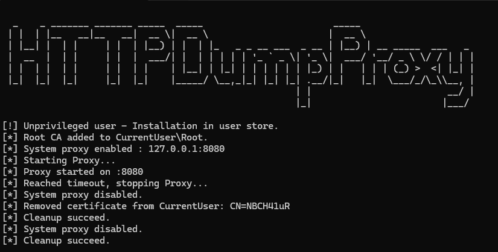

# 🕷️ SimpleHttpProxy

A lightweight, stealthy HTTP/HTTPS proxy designed for **offensive security assessments**, traffic interception, and selective logging.  
It supports **TLS interception with dynamic certificate generation**, **content-based filtering**, and **file-based logging** — all without noisy UI dependencies.*


---

## Why SimpleHttpProxy?

Most interception proxies today (Burp Suite, mitmproxy, etc.) are powerful — but often:

- Too heavy or bloated for **stealth operations**
- Require **interactive UIs** or **Python runtimes**
- Make noisy system changes
- Are overkill for focused, scriptable red team tasks

**SimpleHttpProxy** is purpose-built for red teamers, pentesters, and malware analysts who need:

- A minimalistic proxy that **"just works"**
- **Programmatic control** without GUI overhead
- TLS interception with an **auto-generated CA**
- Selective traffic logging (via regex)
- Temporary usage with automatic cleanup

---

## Legal Disclaimer

> This tool is intended **solely for legal and ethical security testing**.  
> Any use against systems you do not own or have explicit permission to test is **strictly forbidden**.  
> The authors are not responsible for misuse or damages.

---

## Features

**TLS Interception**  
On startup, the proxy generates a self-signed root CA.  
It dynamically signs leaf certificates on-the-fly for each HTTPS hostname intercepted.

**Transparent Logging**  
Requests and responses are optionally dumped to a log file — **only if they match a provided regex** (e.g., sensitive credentials).

**Silent System Integration**  
The root CA is installed into the system store silently if possible.  
System proxy settings are temporarily updated to redirect traffic.

**Automatic Cleanup**  
On exit or timeout, system proxy settings and certificates are **fully removed**, leaving **no trace**.

---

## 🛠️ Usage

```
SimpleHttpProxy.exe [--host 127.0.0.1] [--port 8888] [--timeout 10000] [--log requests.log] [--filter "regex"]
```

### Arguments

| Option         | Description                                              | Default               |
|----------------|----------------------------------------------------------|-----------------------|
| `--host`       | IP address to bind the proxy                             | `127.0.0.1`           |
| `--port`       | Port number to listen on                                 | `8888`                |
| `--timeout`    | Auto-exit timeout in milliseconds                        | `10000`               |
| `--log`        | File path to write filtered traffic                      | `requests.log`        |
| `--filter`     | Regex filter (only log traffic matching this pattern)    | `"Authorization:.*|password=.*"` |

### Examples

### 1. Capture Authorization headers

```
SimpleHttpProxy.exe --filter "Authorization: Bearer" --log auth.log
```

### 2. Passive password discovery

```
SimpleHttpProxy.exe --filter "password=" --timeout 300000
```

### 3. Targeting specific hostname

```
SimpleHttpProxy.exe --filter "Host: internal.priv" --log internal.log
```

---

## Requirements
- Windows 10/11
- .NET 6+

---

## Tips

- You can make the window completely invisible by changing the output type to **"Windows Application"** in Visual Studio (no console window).
- If executed from a non-privileged user, **a Windows confirmation popup will appear** to authorize root CA installation.

---

## Ideas for Future

- SOCKS support
- PAC file compatibility
- Memory-based certificate store for full stealth mode

